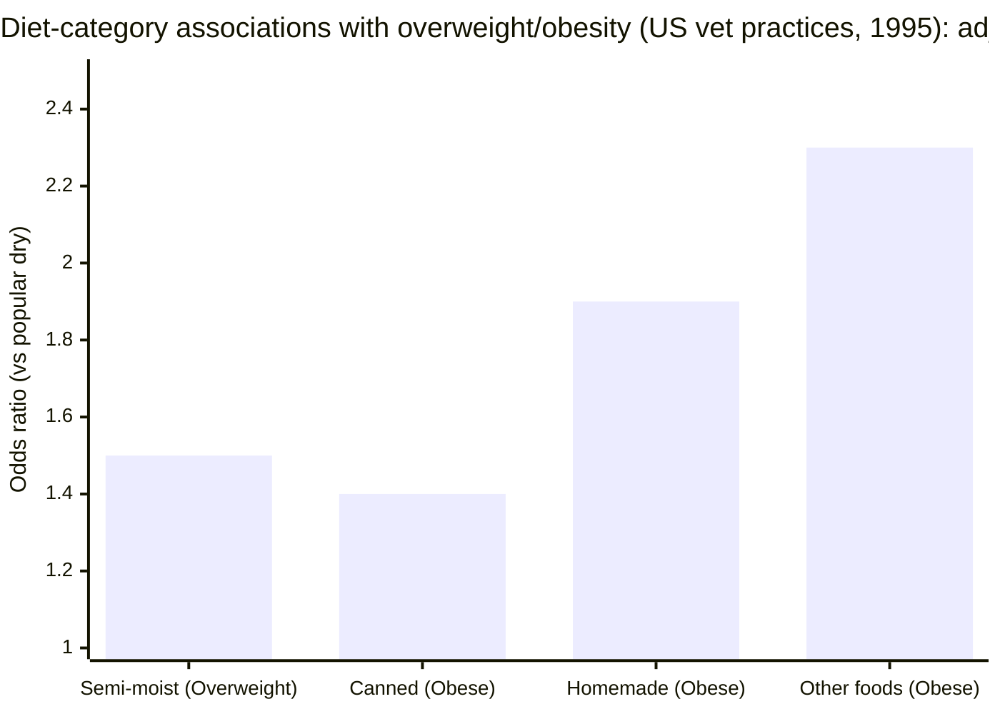
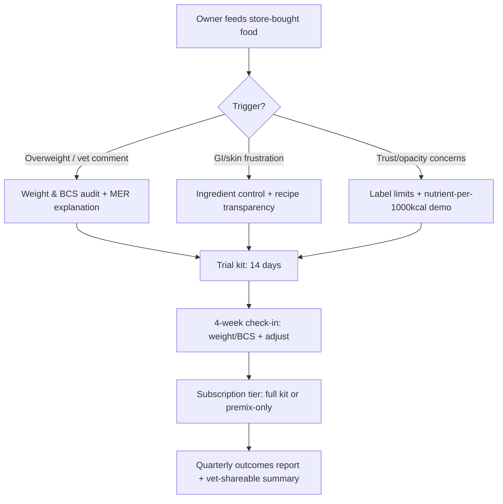

# Store‑Bought Dog Food and Dog Health Outcomes

## Executive summary

I’m not going to pretend the scientific literature says “kibble is killing dogs.” It doesn’t. What it does say—reliably—is that the *dominant, diet‑mediated health burden in pet dogs is excess calorie intake leading to overweight/obesity*, and that current commercial‑food workflows (labels, feeding directions, treat behavior, unclear calorie math, and low feedback loops) make it easy for owners to overfeed without realizing it.

“Store‑bought food” affects health through three primary channels I consider actionable for Dogology’s conversion strategy:  
1) **Energy mismatch** (MER is individualized; feeding guidance and owner habits are not).  
2) **Opacity and category‑level variability** (labels don’t show the nutrient picture owners think they’re buying; some products even fail their intended nutrient standard).  
3) **Risk management** (contaminants and formulation errors are uncommon but real, and owners increasingly demand traceability, proof, and “show me the data” transparency).  

**Where the evidence is strong:**  
- Lean‑fed dogs live longer and develop chronic disease later in a landmark, long‑duration feeding study; weight/BCS management is a longevity lever with unusually good canine evidence.  
- In a large US veterinary‑practice dataset, ~34% of adult dogs were overweight/obese by vet‑assigned BCS, with clear breed/age/neuter associations and measurable associations with food categories (e.g., semi‑moist linked to overweight; canned/homemade/“other” linked to obesity).  
- Periodontal disease is extremely common in dogs, and “dry food cleans teeth” is not a reliable plan compared with true dental homecare strategies; diet format may influence tartar but doesn’t replace brushing/VOHC‑type interventions.  

**Where evidence is suggestive but not definitive (largest gap):**  
- Claims that “fresh” (minimally processed) or “raw” materially improves *clinical* outcomes (longevity, allergy disease burden, chronic disease incidence) are not strongly proven in long, randomized companion‑dog trials; most studies are short, small, biomarker‑or microbiome‑centric, or observational with confounding/reverse causality.  

**Implication for converting commercial‑food buyers to Dogology HealthSpan Kits:**  
The winning narrative is not “commercial food is bad.” It’s:  
- **“Commercial ‘complete & balanced’ is a floor, not an individualized plan.”**  
- **“Owners (and vets) can’t manage what they can’t see.”** Guaranteed analysis is structurally insufficient, calorie math is opaque, and owners routinely drift into over‑ or under‑feeding when circumstances change.  
- **“Dogology is a controlled, auditable system for energy + nutrients.”** Your strongest conversion lever is equation‑level transparency + nutrient‑density guardrails during weight loss + easier feedback loops (weight/BCS) than owners get from a bag/can alone.  

**Key sources I leaned on most heavily** (clickable via citations): regulatory definitions of “complete and balanced” and label requirements; the AAFCO nutrient profile rationale and constraints; obesity and longevity studies; processing by‑product studies (Maillard/AGEs); and large observational datasets on diet type and health conditions.

## Scientific evidence on commercial food types and health outcomes

**Dimension 1 verdict:** Strong evidence supports *weight/energy management* as the primary diet‑linked determinant of morbidity and longevity in pet dogs; direct, causal evidence that one commercial *format* (kibble vs canned vs fresh vs raw vs freeze‑dried) improves long‑term clinical outcomes is limited and often confounded.  

**Key findings**  
1) **Longevity and chronic disease track with leanness in unusually strong canine evidence.** In a landmark study of Labrador Retrievers, ~25% dietary restriction increased median lifespan and delayed chronic disease onset (notably osteoarthritis), supporting “healthspan via leanness” as a real lever rather than a marketing trope.  
2) **Observed associations between “food type” and obesity exist, but are not the whole story.** In the large US private‑practice dataset (1995; n≈21,754 with BCS), overweight/obesity prevalence was ~34.1%, and multivariate models found semi‑moist foods associated with overweight (OR≈1.5) and canned/homemade/“other” foods with obesity (e.g., canned OR≈1.4; “other foods” OR≈2.3; homemade OR≈1.9).  
3) **Short controlled feeding studies suggest processing level changes digestibility, triglycerides, and microbiome—but do not prove better health outcomes.** In one randomized feeding study in healthy adult dogs comparing extruded vs mildly cooked vs raw diets, mildly cooked and raw diets were highly digestible, modified fecal microbiota, and were associated with lower triglycerides vs extruded in that experimental setting.  
4) **Diet‑format comparisons often land on biomarkers (AGEs, metabolomics) rather than clinical endpoints.** Studies in healthy dogs show that differently processed diets are associated with different dietary AGE loads and corresponding differences in plasma/urine AGE measures; another study in senior dogs reported sustained serum metabolomic shifts in dogs fed a fresh “human‑grade” diet vs baseline diet. These are interesting, but they are not the same as showing reduced incident disease or longer lifespan.  
5) **Large observational data can produce counter‑intuitive findings because of reverse causality.** In a large Dog Aging Project cross‑sectional analysis, home‑cooked diets were associated with higher odds of GI, renal/urinary, and hepatic/pancreatic disease vs extruded; authors explicitly note cross‑sectional data are hypothesis‑generating and that reverse causality is plausible (owners may switch to home‑cooked after disease onset).  

image_group{"layout":"carousel","aspect_ratio":"16:9","query":["dry kibble dog food pieces close-up","canned wet dog food pate in bowl","fresh cooked dog food delivery tray","freeze dried raw dog food nuggets"],"num_per_query":1}

**Recommendations and experiments**  
1) **Anchor conversion messaging on what is best‑proven: “healthspan = controlled energy + adequate nutrient density,” not “kibble causes disease.”** Use the longevity/lean‑feeding data as your ethical, evidence‑first centerpiece.  
2) **Build a “claims discipline” map internally:** distinguish (a) what you can claim with high confidence (calorie targeting transparency; AAFCO adult maintenance adequacy; nutrient‑density guardrails) from (b) what you should only discuss as “research suggests” (AGEs, metabolomics, microbiome shifts).  
3) **Run a pragmatic, outcomes‑based pilot (not just satisfaction surveys):** 12–16 weeks, n≈120–200 dogs, compare Dogology kits vs current owner‑selected commercial diet with endpoints of weight change, BCS change, resting metabolic proxy (MER vs observed weight trajectory), stool score consistency, and owner adherence. Use stratification by starting BCS and neuter status because those dominate variance.  
4) **Pre‑register confounders and analysis:** age, sex, neuter status, breed/size, baseline activity, treat calories, concurrent disease, and owner SES variables routinely confound diet‑type associations. Without this, you’ll recreate the ambiguity of the broader literature.  

**Comparison table of commercial formats** (what I’d put in front of a skeptical owner)

| Food type | Typical processing & handling | Nutrition/adequacy “floor” | Main health evidence signal | Main failure modes / risks | What Dogology can credibly outperform |
|---|---|---|---|---|---|
| Kibble (extruded dry) | High‑temperature extrusion; shelf‑stable | Often “complete & balanced” via AAFCO profiles/trials | Good for convenience; obesity risk mainly via energy density/overfeeding; biomarker differences vs less processed diets | Overfeeding; energy mis‑estimation; processing by‑products (MRP/AGE discussion); occasional contaminant/recall events | MER transparency + portion precision + lower‑processing pathway + nutrient‑density control during weight loss |
| Canned wet | Retort/sterilization; shelf‑stable | Often “complete & balanced” | Dental disease still common; some processing by‑product signals; may be useful for palatability/hydration | Cost; storage; some evidence of higher dietary AGEs/MRP vs dry in some analyses | Ingredient‑level transparency + custom nutrient density per kcal; avoid “black box” formulas |
| Fresh (DTC/retail chilled/frozen) | Mild cooking; cold chain | Often claims AAFCO adequacy | Biomarker/metabolomic and digestibility signals in some short studies | Cold‑chain cost; variable transparency; recall risk still exists | “Show your work” nutrition + kit reduces per‑unit factory complexity; recipe auditability |
| Raw (commercial) | Minimal thermal kill; frozen; handling intensive | May or may not be complete/balanced; depends on formulation | Observational studies show mixed associations; digestibility/microbiome differences reported | Pathogen handling risk; nutritional imbalance risk; fat variability | “Cooked‑at‑home kits” as a safer middle ground + premix correctness |
| Freeze‑dried | Dehydration; shelf stable-ish; often “raw style” | Adequacy depends on formulation | Sparse clinical outcomes | Contamination recalls exist (e.g., Salmonella); nutrient oxidation/variability concerns | Transparent sourcing + batch QC plus explicit cooking/storage guidance |

(“Complete and balanced” definition and substantiation methods)  
(Examples of processing by‑products and biomarker work)  
(Recall examples for freeze‑dried / pathogen risk context)  

## Nutritional adequacy and the limits of labels

**Dimension 2 verdict:** Commercial dog food can be nutritionally adequate, but “complete & balanced” is a regulatory/labeling threshold—not a transparent, individualized guarantee; nutrient density per calorie, digestibility/bioavailability, and real‑world calorie restriction are common failure points for owners trying to manage weight with store food.  

**Key findings**  
1) **The legal/consumer‑facing definition matters:** The entity["organization","U.S. Food and Drug Administration","federal food regulator"] states that for a pet food to have “complete and balanced” in its nutritional adequacy statement, it must either meet an entity["organization","Association of American Feed Control Officials","us pet food standards body"] nutrient profile or pass an AAFCO feeding trial.  
2) **AAFCO profiles are designed for “practical” commercial ingredients and explicitly diverge from NRC minimums.** In AAFCO’s own nutrient‑profile documentation, profiles are described as practical minima/maxima for foods formulated from commonly used, complex ingredients; they differ from traditional entity["organization","National Research Council","us scientific advisory body"] minimum requirements and emphasize that digestibility/bioavailability complicate any universal guarantee.  
3) **Guaranteed analysis is structurally incomplete as a “nutrition transparency tool.”** AAFCO’s label guidance emphasizes that the guaranteed analysis is required at minimum for crude protein/fat minima and crude fiber/moisture maxima (and does not require full amino acid, vitamin, and mineral disclosure in the GA box). This is one reason owners cannot “audit” nutrient adequacy from packaging alone.  
4) **Commercial foods occasionally fail nutrient targets even when marketed for adult maintenance.** In an exploratory study of 61 dry/canned diets purchased at retail in entity["city","Fort Collins","Colorado, US"], 18% did not meet at least one AAFCO adult‑maintenance requirement when nutrients were expressed per 1,000 kcal ME.  
5) **Calorie restriction and measurement error create “hidden under‑feeding risk,” especially for protein.** The same study explicitly notes that caloric restriction reduces intake of *all* nutrients and that if calories are restricted without increasing protein concentration, protein intake may not meet minimum needs—this is precisely the real‑world scenario for weight‑loss feeding.  
6) **Even metabolizable‑energy estimation is non‑trivial across food types.** A study testing methods for estimating ME in canine/feline foods found systematic differences and recommends specific equations (e.g., NRC 2006 variants) for better agreement, reinforcing that “kcal on the label” is not always a simple truth.  

**Recommendations and experiments**  
1) **Build your conversion case around “nutrient density per 1,000 kcal” as the key literacy shift.** Show owners why “I fed 20% less” is not nutrition‑neutral and how Dogology maintains nutrient density while adjusting calories.  
2) **Publish a one‑page “label limits” explainer with citations and a calculator:** GA → dry matter → per 1,000 kcal; emphasize that GA is minima/maxima, not the full nutrient ledger.  
3) **Make “weight‑loss mode” a distinct formulation regime:** protein grams/1,000 kcal and micronutrients/1,000 kcal must rise as calories fall. Treat this as a first‑class constraint, not a nice‑to‑have.  
4) **Run an external nutrient‑verification program early:** quarterly third‑party lab testing for macros + key minerals/vitamins on template recipes, and publish per‑batch deltas vs AAFCO targets. This directly addresses owner trust gaps created by GA limitations.  

## Processing and ingredient concerns

**Dimension 3 verdict:** Processing and ingredient concerns are “real but frequently misused.” The scientific core is that heat processing creates measurable chemical changes (Maillard reaction products, AGEs, reactive lysine loss) and that contaminants (mycotoxins, heavy metals, pathogens, formulation errors like vitamin D overdoses) occur; the weaker link is proving that these category‑level signals cause clinically meaningful chronic disease differences between formats in typical pet dogs.  

**Key findings**  
1) **Maillard reaction: established mechanism; uncertain clinical endpoint translation.** A review focused on pet food processing describes how Maillard reactions during heat processing can reduce bioavailability of essential amino acids (notably lysine) and generate early/advanced Maillard reaction products, making processing a plausible nutrition‑quality modifier.  
2) **MRP/AGE load varies widely in commercial foods.** In one analytical study of commercially available dog foods/treats, dry foods had lower reactive lysine ratios than wet foods and estimated MRP intake differed across diet types; the authors emphasize that in‑vivo testing is needed to determine health impact.  
3) **Processing level is linked to measurable AGE differences in dogs.** In healthy dogs, a study comparing ultra‑processed wet, ultra‑processed dry, air‑dried, and mildly cooked diets found differences in dietary AGE load and corresponding differences in plasma/urine AGE markers (e.g., higher dietary AGEs in wet food and higher plasma AGEs with wet food).  
4) **Mycotoxins are a documented exposure in dry dog food.** Multiple surveys have detected mycotoxins (e.g., DON, fumonisins, ochratoxin A, aflatoxins) in extruded dry dog food samples, with risk assessment framing focused on chronic exposure and variability by product.  
5) **Aflatoxin poisonings are a known catastrophic tail risk.** The FDA documents episodes where unsafe aflatoxin levels in pet food were linked with dog illnesses/deaths, illustrating why QA and supply‑chain controls matter even if average risk is low.  
6) **Heavy metals: measurable; often below known toxic thresholds, but exposure differs markedly by ingredient and format.** A peer‑reviewed analysis of 51 OTC dry dog foods found heavy metal content varied by primary protein source (fish‑based higher for arsenic/cadmium/mercury; red meat higher for lead), with authors concluding chronic toxic exposure is unlikely but noting potential concern from outliers and limited dog‑specific toxicity data.  
7) **Glycemic response is diet‑sensitive in dogs, but clinical relevance depends on context.** Controlled studies demonstrate that carbohydrate source/level can modulate postprandial glucose/insulin responses in healthy dogs, supporting “carb quality and structure matters,” even if this does not automatically translate into disease prevention claims.  
8) **Preservatives are regulated and have safety dossiers—but remain a perception trigger.** The entity["organization","European Food Safety Authority","eu food safety agency"] FEEDAP panel has assessed BHA as a feed additive and permitted specified levels for animal feeds (with species caveats), showing this is a governed domain even when consumer sentiment is negative.  

**Recommendations and experiments**  
1) **Message “processing” carefully:** don’t claim ultra‑processing *causes* chronic disease in dogs; do claim that Dogology minimizes processing steps and can quantify/monitor processing‑linked compounds (e.g., reactive lysine proxies) over time as part of QA.  
2) **Adopt a contaminant testing standard that commercial labels do not show:** routine screens for mycotoxins (grain/starch inputs), heavy metals (fish/organs), and microbial kill verification where applicable; then publish batch‑level results as a trust asset.  
3) **Turn “novel proteins” into a quantified choice rather than a vibe:** allow opt‑outs for fish‑heavy recipes and show ingredient‑source reasoning since fish‑based diets can be higher in certain heavy metals.  
4) **Prototype a “glycemic‑aware” option only if you can measure outcomes:** if you offer lower‑starch templates, pair with endpoints (weight, triglycerides, fasting glucose/fructosamine where indicated) and avoid diabetes‑prevention claims.  

## Epidemiology and population data

**Dimension 4 verdict:** At population scale, overweight/obesity and dental disease are the two most defensible “diet‑adjacent” problems to target; both show clear age/breed/neuter gradients and strong owner‑behavior dependence. Diet format is a modifier, but the owner feedback loop is the engine.  

**Key findings**  
1) **US obesity prevalence and diet‑type associations in a large vet‑practice dataset:** In the US private‑practice dataset (1995), 34.1% of adult dogs were overweight/obese by BCS; multivariate models identified breed, neuter status, and food category associations (semi‑moist with overweight; canned/homemade/“other” with obesity).  
2) **Breed and neuter effects are large enough that “one feeding chart” is structurally wrong.** The same dataset shows distinct breed risks and strong neuter associations (e.g., neuter OR ~1.5 for overweight; also associated with obesity), reinforcing the need for individualized MER and trajectory monitoring.  
3) **Owner feeding behavior and dog food motivation are measurable predictors of overweight in a modern US cohort.** In a Dog Aging Project study, overweight physical condition was positively associated with owner feeding management score and dog food motivation score; dog demographics and developed environment also mattered.  
4) **Dental disease is near‑ubiquitous by mid‑life and worsens with age, especially in small breeds.** Cornell’s veterinary guidance states studies show 80–90% of dogs over age 3 have some component of periodontal disease; research in dogs (e.g., beagles) documents high prevalence of attachment loss by >3 years.  
5) **Diet choice correlates with owner demographics and dog size, shaping who is actually convertible.** A Dog Aging Project cross‑sectional analysis of diet choices in a US cohort links diet types (including freeze‑dried, canned, home‑cooked) with dog and owner demographics, which can be used to define a realistic SAM for kits.  

**Obesity “by diet type” chart (best available quantitative signal)**  
Robust, modern prevalence estimates stratified cleanly by *commercial format* are rare in peer‑reviewed companion‑dog datasets. The US private‑practice study provides adjusted odds ratios by major food categories (a proxy for “diet type matters,” not a prevalence split). Below, I chart the food‑category odds ratios reported in the multivariate model. (This is an evidence gap you can fill in Dogology pilots.)  

**Recommendations and experiments**  
1) **Make body condition the conversion headline:** “We keep your dog in the life‑extending BCS zone” is closer to strong evidence than almost any disease‑promise. Pair with weight‑trajectory tooling and vet‑interpretable reporting.  
2) **Build breed/size‑aware defaults:** use breed group/size priors for MER uncertainty bands and for intervention frequency, because population data shows those are dominant modifiers.  
3) **Treat treats as “the hidden diet” inside your product:** obesity surveys repeatedly highlight treats/table scraps; instrument them in the product (treat budget, alerts, substitution suggestions).  
4) **Don’t over‑market dental claims; integrate dental prevention protocols.** A kit can include safe chew guidance, brushing onboarding, and referral prompts; dental disease prevalence is huge, but food format alone won’t solve it.  

## Consumer behavior and conversion levers

**Dimension 5 verdict:** Owners buy store food primarily for convenience, price predictability, and perceived safety/legitimacy; they switch when they feel (a) loss of trust, (b) an acute health trigger (overweight, GI, skin), or (c) identity alignment (“I feed my dog like family”). Dogology will convert best by reducing friction and increasing trust via transparency—not by escalating fear.  

**Key findings**  
1) **What drives purchase decisions is consistent across peer‑reviewed consumer studies:** ingredient composition/quality cues, price, brand reputation, sustainability narratives, and pet health status are repeatedly identified as determinants of commercial pet food choice in a PRISMA‑style systematic review.  
2) **Raw/home‑prepared communities are motivated by “control” and “naturalness,” but often exhibit lower trust in veterinary nutrition advice.** Surveys of owners feeding raw animal products and RMBDs document strong motivations and also quantify the vet‑trust gap, which matters for how Dogology frames “vet‑aligned” positioning without sounding preachy.  
3) **Many owners feed mixed diets, making calorie accounting hard.** Even in the NZ survey, owners commonly reported feeding treats, pet‑shop specialty foods, supermarket biscuits, raw meat, and table scraps—exactly the pattern that breaks “follow the bag” guidance.  
4) **Owners misperceive body condition often enough to break feedback loops.** The same survey reported notable disagreement about what a healthy body condition looks like, implying that “education + tools” can move outcomes if done well.  
5) **Dog and owner demographics predict diet choices, which you can exploit for targeting.** In the Dog Aging Project cohort, diet choices differ by dog size and owner age (e.g., smaller dogs more likely to receive some canned/freeze‑dried/home‑cooked components), informing who is most likely to accept a “cook at home” kit workflow.  
6) **Premiumization is real—but price sensitivity is rising.** Industry sources describe sustained interest in premium/functional pet foods and consumer pressure from higher prices, which implies Dogology needs tiering and clear value framing.  

**Recommendations and experiments**  
1) **Message the job‑to‑be‑done as “confidence + control with guardrails.”** Your best psychological wedge is: “You can cook, but you don’t have to do the math.” This directly addresses the core desire driver identified in alternative‑diet surveys.  
2) **Reduce adoption friction with a “cook once, feed 3–4 days” protocol and time‑tracked onboarding.** Treat time cost as a measurable KPI; ask for minutes, not vibes, and optimize the workflow.  
3) **Segment conversion by trigger:** (a) weight/BCS trigger; (b) GI sensitivity trigger; (c) transparency/trust trigger. Then A/B test landing pages and emails aligned to each trigger with different proof packs (weight study vs label transparency vs ingredient provenance).  
4) **Use veterinarians as “credibility accelerators,” not as gatekeepers.** Because some alternative‑diet owners distrust vets, the vet channel should be optional but visible: “Your vet can review the printout.”  

## Regulatory and labeling realities in the US

**Dimension 6 verdict:** Regulation is not your enemy—it’s a conversion lever if you stay disciplined. The safest high‑credibility position is “formulated to meet AAFCO adult maintenance” + radical transparency about calculations and nutrient targets, while avoiding disease claims and deferring “human‑grade” until documentation and audits are complete.  

**Key findings**  
1) **“Complete and balanced” has specific substantiation pathways.** FDA consumer guidance states that “complete and balanced” requires either meeting AAFCO nutrient profiles or passing AAFCO feeding trials.  
2) **The nutritional adequacy statement is the label’s “load‑bearing line.”** AAFCO’s consumer guidance emphasizes that the nutritional adequacy statement is the key label element for matching product to life stage and for interpreting “complete and balanced.”  
3) **Guaranteed analysis is limited by design.** AAFCO’s own labeling guidance clarifies minimum GA requirements (protein/fat minima; fiber/moisture maxima), reinforcing that consumers do not get a full micronutrient panel from standard labeling.  
4) **AAFCO profiles explicitly acknowledge digestibility, ingredient complexity, and the limits of universal adequacy.** The AAFCO nutrient profile document explains why values differ from NRC minima and states that formulating to profiles is only one part of nutritionally sound development; it also highlights bioavailability/digestibility issues and encourages feeding trials as further confirmation.  
5) **“Human‑grade” is tightly constrained and applies to the whole product, not just ingredients.** AAFCO’s human‑grade FAQ and the AAFCO human‑grade standard both state the term is only acceptable for the product as a whole and requires that every ingredient and the resulting product be stored/handled/processed/transported to human food standards (including compliance with human food regulations such as 21 CFR 117), with documentation and audit expectations.  
6) **Even labels and websites count for human‑grade communication rules.** The AAFCO human‑grade standard indicates requirements apply across labeling forms (including websites and marketing materials) and constrains the way “human grade” can appear relative to intended use statements.  

**Recommendations and experiments**  
1) **Use template recipes (registered) + per‑dog feeding instructions (personalized) as your compliance‑first architecture.** This aligns with AAFCO’s focus on substantiation methods and reduces the regulatory fragility of per‑dog formula generation.  
2) **Adopt “marketing‑safe transparency”:** publish your nutrient tables and MER math as educational content, but avoid claims like “prevents kidney disease,” “treats allergies,” or other therapeutic language that can trigger regulatory scrutiny.  
3) **Delay “human‑grade” until you can pass an audit trail test.** In conversion messaging, you can still talk about provenance, ingredient sourcing, and verified processes without using the term until you’re ready.  
4) **Build recall readiness as part of trust.** FDA’s recall/advisory ecosystem spans multiple formats (dry, frozen, freeze‑dried); publish your own response playbook and traceability capabilities as a differentiator.  

## Competitive landscape and conversion strategy

**Dimensions 7 and 8 verdict:** Incumbents can (and will) copy surface features (a calculator, “vet‑formulated” language, even a DIY kit). Dogology’s defensible wedge is operationally hard: *auditable nutrition math + nutrient adequacy per kcal under calorie restriction + ingredient‑level transparency + longitudinal outcomes measurement*—delivered with friction low enough that real owners stick.  

**Key findings**  
1) **Incumbents compete on convenience and emotional certainty.** The premium/fresh segment markets “real ingredients,” palatability, personalization, and (sometimes) “human‑grade” cues; meanwhile, traditional brands lean on “complete & balanced,” price, and “vet recommended” positioning. This is why attacking commercial food as “bad” often backfires—owners are purchasing reassurance.  
2) **Diet choice is identity‑laden, which is why transparency is a conversion superpower.** Peer‑reviewed surveys show that alternative‑diet adopters seek control and often distrust institutions; Dogology can win by showing the equations and letting owners inspect the nutrient ledger rather than asking for blind faith.  
3) **“Diet type → health outcome” is not a slam dunk, so your competitive claims must be narrower than your product benefits.** The Dog Aging Project diet‑type/health‑conditions analysis illustrates how observational findings can be ambiguous and how reverse causality can dominate; Dogology should therefore compete on measurable controllables (weight/BCS trajectory adherence; nutrient adequacy) while gathering better evidence on broader endpoints.  
4) **The market is large, but your real SAM is the subset willing to do *any* prep.** Diet choice demographics in the Dog Aging Project show which owners already feed canned/freeze‑dried/home‑cooked components (a proxy for willingness to accept partial prep). Focus there first.  
5) **Safety incidents span formats, so “we’re safer because we’re X” is fragile.** FDA recall/advisory history includes dry foods, frozen foods, and freeze‑dried treats; the best safety story is “we test, trace, and respond,” not “our format is immune.”  

**Conversion strategy recommendations and experiments**  

**Messaging that I would bet on (evidence‑based, regulator‑safe)**  
1) **“The label can’t tell you what your dog is actually getting.”** Then show a side‑by‑side of GA vs your nutrient‑per‑1,000‑kcal table and MER math. (This uses AAFCO/FDA realities without attacking any one competitor.)  
2) **“Weight is the #1 measurable lever for more good years.”** Use the caloric restriction longevity study as scientific backbone; position Dogology as an execution system for it.  
3) **“Cook with control, without deficiencies.”** Emphasize that your premix + recipe templates are designed to meet AAFCO adult maintenance, and you show the math.  
4) **“Your vet can audit this.”** Provide a printable “nutrition report” (MER inputs, calorie target, targets vs achieved per 1,000 kcal, ingredient list, batch IDs). Vet‑compatibility is a trust multiplier.  

**Pilot experiments to fill major data gaps**  
1) **Pragmatic RCT (or cluster‑randomized vet‑clinic trial) for weight/BCS:**  
   - n≈200 dogs, 16 weeks; inclusion BCS ≥6/9 (overweight).  
   - Arms: (A) Dogology kit + feedback loop; (B) owner’s current commercial food + standard “feed less” advice.  
   - Endpoints: % achieving ≥1‑point BCS reduction; mean % weight loss; adherence; adverse GI events; owner trust score.  
   Solid rationale: weight outcomes are measurable and strongly linked to healthspan.  
2) **Nutrient sufficiency monitoring pilot (safety proof):**  
   - n≈60 dogs, 6 months; quarterly labs in a subset (e.g., vitamin D status marker, selected trace elements) + clinical chemistry.  
   - Aim: demonstrate “no systematic drift” under controlled kits and feeding adjustments.  
   This is especially valuable given known episodes of nutrient excess (vitamin D toxicity recalls) and known variability in commercial products.  
3) **Behavioral friction pilot (“time to feed”):**  
   - n≈150 owners, 4 weeks; measure minutes/week spent on feeding tasks; compare kibble vs Dogology kit vs “premix‑only DIY.”  
   - Endpoint: time cost and drop‑off points; optimize workflow.  
   This aligns to consumer‑behavior literature: convenience is a primary driver.  

**Pricing and tiering tactics that match market reality**  
1) **Offer a two‑tier entry ramp:** (A) Full kit; (B) “Premix + recipe + shopping list.” This directly matches price sensitivity while preserving your “math + adequacy” value proposition.  
2) **Risk‑reversal without medical promises:** a “BCS check‑in guarantee” (e.g., if no measurable improvement over X weeks with adherence, extend coaching) is safer than disease claims and aligns with the strongest evidence base.  

**Vet channel tactics**  
1) **Start with weight management, not disease:** obesity is ubiquitous, politically safe, and clinically meaningful; it avoids therapeutic‑diet regulatory traps.  
2) **Provide clinic‑friendly artifacts:** one‑page plan, calories/day, grams/day, treat budget, and recheck schedule; align with WSAVA‑style nutrition assessment workflows used in practice.  

**Metrics I would track (conversion and clinical)**  
- Funnel: landing → quiz completion → first order → 4‑week retention → 12‑week retention. (Tie to segmentation triggers.)  
- Clinical: weight trajectory vs modeled curve; BCS change; owner‑reported stool score; adverse event rate.  
- Trust: “I understand my dog’s calorie target” and “I can audit ingredients/nutrients” as leading indicators (these should move before clinical outcomes).  

**Conversion flow I would implement early** (conceptual)

(For the “trigger” reality and why owner behavior dominates)
